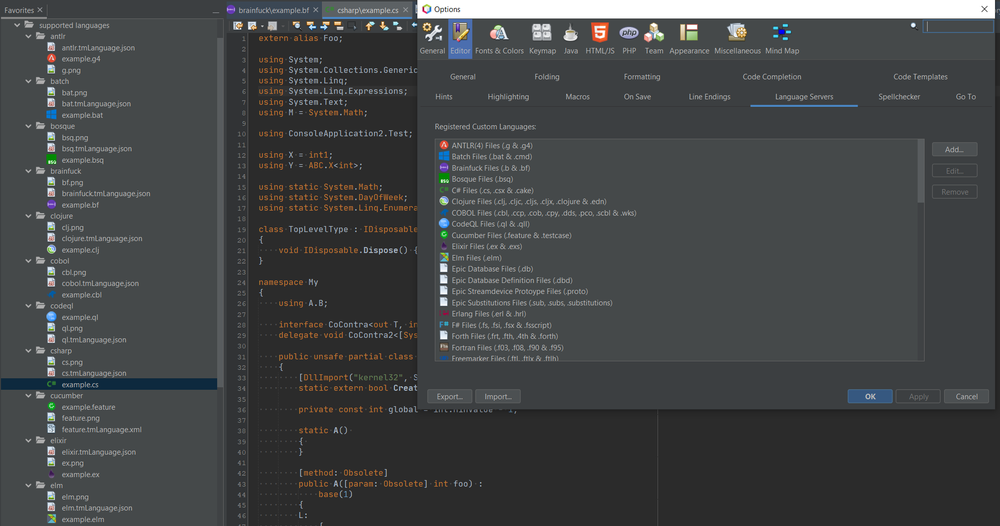

# Apache NetBeans textmate files
This repository is a collection of textmate files to add them easily to NetBeans, to add basic syntax highlighting for
a lot of languages. Over 50 languages are supported. Apache NetBeans >= 12.0 is required. I know that the GUI was implemented earlier, so you can also try 11.3 but on your own risk.

Those files where copied from differnet places, most of the time from the repos, that created similiar plugins for VS Code.

## How to use:
1. Move the folder `supported languages` to whereever you want.
2. Open the `textmate-description.json` file of this repository.
3. Change the paths to the correct folders/files (Depends on your system).
4. Take the JSON and minify it [e.g. here](https://www.browserling.com/tools/json-minify).
5. If available, open the `client.properties` (NetBeans related) file which is located here:

    Windows

        %userprofile%\AppData\Roaming\NetBeans\YourNetBeansVersion\config\Preferences\org\netbeans\modules\lsp

    Linux

        $HOME/.netbeans/YourNetBeansVersion/config/Preferences/org/netbeans/modules/lsp
        
    MacOS
    
        $HOME/Library/Application\ Support/NetBeans/YourNetBeansVersion/config/Preferences/org/netbeans/modules/lsp
6. If the folder and the file is not available (happens when you start NetBeans the first time and never touched the language server options), create the missing folder and the missing properties file and add this line to it `language.descriptions=[]`
6. Replace the array with your minified version.
7. Restart NetBeans.
8. After restarting NetBeans, go to `Options` -> `Editors (You need to have one Project open to see this Tab)` -> `Language Servers`.
9. You should see now all added languages.
10. To apply them to NetBeans, select one language in the table, click on edit, click on ok.
11. Click apply inside the options.
12. Wait couple of seconds until NetBeans responded again.
13. Click ok.
14. Done.

## Screenshot

## Legend
:x: - Known Problems, tickets already created.

Some languages are also just embedded languages like handlebars or silverstripe or others, those are not well supported, because the implementation doesn't know the language around that

## Collected languages:
* ANTLR(4) Files (.g & .g4) - [https://github.com/mike-lischke/vscode-antlr4/blob/master/syntaxes/antlr.json](https://github.com/mike-lischke/vscode-antlr4/blob/master/syntaxes/antlr.json)
* Batch Files (.bat & .cmd) - [https://github.com/microsoft/vscode/blob/master/extensions/bat/syntaxes/batchfile.tmLanguage.json](https://github.com/microsoft/vscode/blob/master/extensions/bat/syntaxes/batchfile.tmLanguage.json)
* Bosque Files (.bsq) - [https://github.com/microsoft/BosqueLanguage/blob/master/bosque-language-tools/syntaxes/bosque.tmLanguage.json](https://github.com/microsoft/BosqueLanguage/blob/master/bosque-language-tools/syntaxes/bosque.tmLanguage.json)
* Brainfuck Files (.b & .bf) - [https://github.com/attilabuti/brainfuck-syntax/blob/master/syntaxes/brainfuck.tmLanguage.json](https://github.com/attilabuti/brainfuck-syntax/blob/master/syntaxes/brainfuck.tmLanguage.json)
* C# Files (.cs, .csx & .cake) - [https://github.com/microsoft/vscode/blob/master/extensions/csharp/syntaxes/csharp.tmLanguage.json](https://github.com/microsoft/vscode/blob/master/extensions/csharp/syntaxes/csharp.tmLanguage.json)
* Clojure Files (.clj, .cljc, .cljs, .cljx, .clojure & .edn) - [https://github.com/microsoft/vscode/blob/master/extensions/clojure/syntaxes/clojure.tmLanguage.json](https://github.com/microsoft/vscode/blob/master/extensions/clojure/syntaxes/clojure.tmLanguage.json)
* COBOL Files (.cbl, .ccp, .cob, .cpy, .dds, .pco, .scbl & .wks) - [https://github.com/spgennard/vscode_cobol/blob/master/syntaxes/COBOL.tmLanguage.json](https://github.com/spgennard/vscode_cobol/blob/master/syntaxes/COBOL.tmLanguage.json)
* CodeQL Files (.ql & .qll) - [https://github.com/github/vscode-codeql/blob/main/syntaxes/ql.tmLanguage.json](https://github.com/github/vscode-codeql/blob/main/syntaxes/ql.tmLanguage.json)
* CoffeeScript Files (.coffee, .csom & .iced) - [https://github.com/microsoft/vscode/blob/main/extensions/coffeescript/syntaxes/coffeescript.tmLanguage.json](https://github.com/microsoft/vscode/blob/main/extensions/coffeescript/syntaxes/coffeescript.tmLanguage.json)
* Crystal Files (.cr) - [https://github.com/crystal-lang-tools/vscode-crystal-lang/blob/master/syntaxes/crystal.json](https://github.com/crystal-lang-tools/vscode-crystal-lang/blob/master/syntaxes/crystal.json)
* Cucumber Files (.feature & .testcase) - [https://github.com/alexkrechik/VSCucumberAutoComplete/blob/master/gclient/syntaxes/feature.tmLanguage](https://github.com/alexkrechik/VSCucumberAutoComplete/blob/master/gclient/syntaxes/feature.tmLanguage)
* D Files (.d & .di) - [https://github.com/Pure-D/code-d/blob/master/syntaxes/d.json](https://github.com/Pure-D/code-d/blob/master/syntaxes/d.json)
* Dart Files (.dart) - [https://github.com/Dart-Code/Dart-Code/blob/master/syntaxes/dart.json](https://github.com/Dart-Code/Dart-Code/blob/master/syntaxes/dart.json)
* Elixir Files (.ex & .exs) - [https://github.com/fr1zle/vscode-elixir/blob/master/syntaxes/elixir.json](https://github.com/fr1zle/vscode-elixir/blob/master/syntaxes/elixir.json)
* Elm Files (.elm) - [https://github.com/elm-tooling/elm-language-client-vscode/blob/master/syntaxes/elm-syntax.json](https://github.com/elm-tooling/elm-language-client-vscode/blob/master/syntaxes/elm-syntax.json)
* Epic Database Files (.db) - [https://github.com/NSenaud/vscode-epics/blob/master/syntaxes/db.tmLanguage.json](https://github.com/NSenaud/vscode-epics/blob/master/syntaxes/db.tmLanguage.json)
* Epic Database Definition Files (.dbd) - [https://github.com/NSenaud/vscode-epics/blob/master/syntaxes/dbd.tmLanguage.json](https://github.com/NSenaud/vscode-epics/blob/master/syntaxes/dbd.tmLanguage.json)
* Epic Streamdevice Protoype Files (.proto) - [https://github.com/NSenaud/vscode-epics/blob/master/syntaxes/proto.tmLanguage.json](https://github.com/NSenaud/vscode-epics/blob/master/syntaxes/proto.tmLanguage.json)
* Epic Substitutions Files (.sub, .subs, .substitutions) - [https://github.com/NSenaud/vscode-epics/blob/master/syntaxes/sub.tmLanguage.json](https://github.com/NSenaud/vscode-epics/blob/master/syntaxes/sub.tmLanguage.json)
* Erlang Files (.erl & .hrl) - [https://raw.githubusercontent.com/erlang-ls/grammar/main/Erlang.plist](https://raw.githubusercontent.com/erlang-ls/grammar/main/Erlang.plist)
* F# Files (.fs, .fsi, .fsx & .fsscript) - [https://github.com/microsoft/vscode/blob/master/extensions/fsharp/syntaxes/fsharp.tmLanguage.json](https://github.com/microsoft/vscode/blob/master/extensions/fsharp/syntaxes/fsharp.tmLanguage.json)
* Forth Files (.frt, .fth, .4th & .forth) - [https://github.com/hirnidrin/vscode-lang-forth/blob/master/syntaxes/forth.tmLanguage.json](https://github.com/hirnidrin/vscode-lang-forth/blob/master/syntaxes/forth.tmLanguage.json)
* Fortran Files (.f03, .f08, .f90 & .f95) - [https://github.com/krvajal/vscode-fortran-support/blob/master/syntaxes/fortran_free-form.tmLanguage.json](https://github.com/krvajal/vscode-fortran-support/blob/master/syntaxes/fortran_free-form.tmLanguage.json)
* :x: - [NETBEANS-4539](https://issues.apache.org/jira/browse/NETBEANS-4539) Freemarker Files (.ftl) - [https://github.com/dcortes92/vs-freemarker/blob/master/syntaxes/ftl.tmLanguage](https://github.com/dcortes92/vs-freemarker/blob/master/syntaxes/ftl.tmLanguage)
* Fuchsia Files (.fidl) - [https://fuchsia.googlesource.com/vscode-language-fidl/+/refs/heads/master/syntaxes/fidl.tmLanguage.json](https://fuchsia.googlesource.com/vscode-language-fidl/+/refs/heads/master/syntaxes/fidl.tmLanguage.json)
* Galen Files (.gspec) - [https://github.com/simonhdickson/galen-vscode-extension/blob/master/syntaxes/galen.tmLanguage](https://github.com/simonhdickson/galen-vscode-extension/blob/master/syntaxes/galen.tmLanguage) 
* GLSL Files (.comp, .fshader, .frag, .geom, .glsl, .gs, .gsh, .gshader, .tesc, .tese, .vert, .vs & .vshader) - [https://github.com/euler0/sublime-glsl/blob/master/GLSL.tmLanguage](https://github.com/euler0/sublime-glsl/blob/master/GLSL.tmLanguage)
* Go Files (.go) - [https://github.com/microsoft/vscode/blob/master/extensions/go/syntaxes/go.tmLanguage.json](https://github.com/microsoft/vscode/blob/master/extensions/go/syntaxes/go.tmLanguage.json)
* GraphQL Files (.gql, .graphql, .graphqls & .prisma) - [https://github.com/rmosolgo/language-graphql/blob/master/grammars/graphql.json](https://github.com/rmosolgo/language-graphql/blob/master/grammars/graphql.json)
* Graphviz Files (.dot) - [https://github.com/Stephanvs/vscode-graphviz/blob/master/dot/syntaxes/dot.tmLanguage](https://github.com/Stephanvs/vscode-graphviz/blob/master/dot/syntaxes/dot.tmLanguage)
* HAML Coffee Files (.hamlc) - [https://github.com/HarlemSquirrel/language-haml/blob/master/grammars/coffee%20haml.cson](https://github.com/HarlemSquirrel/language-haml/blob/master/grammars/coffee%20haml.cson)
* HAML Ruby Files (.haml & .inky-haml) - [https://github.com/HarlemSquirrel/language-haml/blob/master/grammars/ruby%20haml.cson](https://github.com/HarlemSquirrel/language-haml/blob/master/grammars/ruby%20haml.cson)
* Handlebar Files (.handlebars, .hbs & .hjs) - [https://github.com/Microsoft/vscode/blob/master/extensions/handlebars/syntaxes/Handlebars.tmLanguage.json](https://github.com/Microsoft/vscode/blob/master/extensions/handlebars/syntaxes/Handlebars.tmLanguage.json)
* Haskell Files (.hs & .hsig) - [https://github.com/HeinrichApfelmus/textmate-haskell/blob/master/Haskell.tmbundle/Syntaxes/Haskell.tmLanguage](https://github.com/HeinrichApfelmus/textmate-haskell/blob/master/Haskell.tmbundle/Syntaxes/Haskell.tmLanguage)
* Haxe Files (.hx & .dump) - [https://github.com/vshaxe/haxe-TmLanguage/blob/6e7f85bd0ee7f453ffaeefa291aeff3c41667b5a/haxe.tmLanguage](https://github.com/vshaxe/haxe-TmLanguage/blob/6e7f85bd0ee7f453ffaeefa291aeff3c41667b5a/haxe.tmLanguage)
* HLSL Files (.cginc, .comput, .fx, .fxh, .hlsl, .hlsli, .psh, & .vsh) - [https://github.com/Microsoft/vscode/blob/master/extensions/hlsl/syntaxes/hlsl.tmLanguage.json](https://github.com/Microsoft/vscode/blob/master/extensions/hlsl/syntaxes/hlsl.tmLanguage.json)
* HQL Files (.hql) - [https://github.com/adidonato/language-hql/blob/master/grammars/hql.cson](https://github.com/adidonato/language-hql/blob/master/grammars/hql.cson)
* Http RestClient Files (.http) - [https://github.com/Huachao/vscode-restclient/blob/master/syntaxes/http.tmLanguage.json](https://github.com/Huachao/vscode-restclient/blob/master/syntaxes/http.tmLanguage.json)
* Julia Files (.jl) - [https://github.com/julia-vscode/julia-vscode/blob/master/syntaxes/julia_vscode.json](https://github.com/julia-vscode/julia-vscode/blob/master/syntaxes/julia_vscode.json)
* LaTeX Files (.tex) - [https://github.com/James-Yu/LaTeX-Workshop/blob/master/syntax/LaTeX.tmLanguage.json](https://github.com/James-Yu/LaTeX-Workshop/blob/master/syntax/LaTeX.tmLanguage.json)
* LISP Files (.asd, .asdf, .cl, .lisp, .lsp & .ros) - [https://github.com/ailisp/commonlisp-vscode/blob/master/syntaxes/commonlisp.tmLanguage](https://github.com/ailisp/commonlisp-vscode/blob/master/syntaxes/commonlisp.tmLanguage)
* LLVM Files (.ll) - [https://github.com/whitequark/LLVM.tmBundle/blob/master/Syntaxes/LLVM.tmLanguage](https://github.com/whitequark/LLVM.tmBundle/blob/master/Syntaxes/LLVM.tmLanguage)
* LOG Files (.log) - [https://github.com/Microsoft/vscode/blob/master/extensions/log/syntaxes/log.tmLanguage.json](https://github.com/Microsoft/vscode/blob/master/extensions/log/syntaxes/log.tmLanguage.json)
* LOLCode Files (.lol) - [https://github.com/arwinneil/vscode-lolcode/blob/master/syntaxes/lol.tmLanguage](https://github.com/arwinneil/vscode-lolcode/blob/master/syntaxes/lol.tmLanguage)
* Lua Files (.lua) - [https://github.com/microsoft/vscode/blob/master/extensions/lua/syntaxes/lua.tmLanguage.json](https://github.com/microsoft/vscode/blob/master/extensions/lua/syntaxes/lua.tmLanguage.json)
* :x: - [NETBEANS-4539](https://issues.apache.org/jira/browse/NETBEANS-4539) Markdown Files (.markdown & .md) - [https://github.com/microsoft/vscode-markdown-tm-grammar/blob/master/syntaxes/markdown.tmLanguage](https://github.com/microsoft/vscode-markdown-tm-grammar/blob/master/syntaxes/markdown.tmLanguage)
* Nim Files (.nim, .nims & .nim.cfg) - [https://github.com/pragmagic/vscode-nim/blob/master/syntaxes/nim.json](https://github.com/pragmagic/vscode-nim/blob/master/syntaxes/nim.json)
* Objective-C Files (.m) - [https://github.com/microsoft/vscode/blob/master/extensions/objective-c/syntaxes/objective-c.tmLanguage.json](https://github.com/microsoft/vscode/blob/master/extensions/objective-c/syntaxes/objective-c.tmLanguage.json)
* Objective-C++ Files (.mm) - [https://github.com/microsoft/vscode/blob/master/extensions/objective-c/syntaxes/objective-c%2B%2B.tmLanguage.json](https://github.com/microsoft/vscode/blob/master/extensions/objective-c/syntaxes/objective-c%2B%2B.tmLanguage.json)
* OCaml Files (.ml & .mli) - [https://github.com/hackwaly/vscode-ocaml/blob/master/syntaxes/OCaml.tmLanguage](https://github.com/hackwaly/vscode-ocaml/blob/master/syntaxes/OCaml.tmLanguage)
* OpenSCAD Files (.scad) - [https://github.com/tbuser/openscad.tmbundle/blob/master/Syntaxes/OpenSCAD.tmLanguage](https://github.com/tbuser/openscad.tmbundle/blob/master/Syntaxes/OpenSCAD.tmLanguage)
* Perl Files (.pl, .pm, .pod, .psgi & .t) - [https://raw.githubusercontent.com/microsoft/vscode/master/extensions/perl/syntaxes/perl.tmLanguage.json](https://raw.githubusercontent.com/microsoft/vscode/master/extensions/perl/syntaxes/perl.tmLanguage.json)
* Perl6 Files (.nqp, .p6, .pl6 & .pm6) - [https://raw.githubusercontent.com/microsoft/vscode/master/extensions/perl/syntaxes/perl6.tmLanguage.json](https://raw.githubusercontent.com/microsoft/vscode/master/extensions/perl/syntaxes/perl6.tmLanguage.json)
* Powershell Files (.ps1, .psd1, .psm1, .psrc & .pssc) - [https://github.com/microsoft/vscode/blob/master/extensions/powershell/syntaxes/powershell.tmLanguage.json](https://github.com/microsoft/vscode/blob/master/extensions/powershell/syntaxes/powershell.tmLanguage.json)
* PureScript Files (.purs) - [https://github.com/nwolverson/vscode-language-purescript/blob/master/syntaxes/purescript.json](https://github.com/nwolverson/vscode-language-purescript/blob/master/syntaxes/purescript.json)
* Python Files (.gyp, .gypi, .ipy, .py, .pyi, .pyw & .rpy) - [https://github.com/microsoft/vscode/blob/master/extensions/python/syntaxes/MagicPython.tmLanguage.json](https://github.com/microsoft/vscode/blob/master/extensions/python/syntaxes/MagicPython.tmLanguage.json)
* Q# Files (.qs) - [https://github.com/microsoft/qsharp-compiler/blob/master/src/VSCodeExtension/syntaxes/qsharp.tmLanguage.json.v.template](https://github.com/microsoft/qsharp-compiler/blob/master/src/VSCodeExtension/syntaxes/qsharp.tmLanguage.json.v.template)
* R Files (.r, .Rprofile & .s) - [https://github.com/Ikuyadeu/vscode-R/blob/master/syntax/r.json](https://github.com/Ikuyadeu/vscode-R/blob/master/syntax/r.json)
* Razor Files (.cshtml) - [https://github.com/microsoft/vscode/blob/master/extensions/razor/syntaxes/cshtml.tmLanguage.json](https://github.com/microsoft/vscode/blob/master/extensions/razor/syntaxes/cshtml.tmLanguage.json)
* ReasonML Files (.re & rei) - [https://raw.githubusercontent.com/reasonml-editor/vscode-reasonml/master/syntaxes/reason.json](https://raw.githubusercontent.com/reasonml-editor/vscode-reasonml/master/syntaxes/reason.json)
* ReasonML Opam Files (.opam) - [https://raw.githubusercontent.com/reasonml-editor/vscode-reasonml/master/syntaxes/opam.json](https://raw.githubusercontent.com/reasonml-editor/vscode-reasonml/master/syntaxes/opam.json)
* ReScript Files (.res & .resi) - [https://raw.githubusercontent.com/rescript-lang/rescript-vscode/master/grammars/rescript.tmLanguage.json](https://raw.githubusercontent.com/rescript-lang/rescript-vscode/master/grammars/rescript.tmLanguage.json)
* Rholang Files (.rho) - [https://raw.githubusercontent.com/tgrospic/rholang-vscode/master/syntaxes/rho.tmLanguage.json](https://raw.githubusercontent.com/tgrospic/rholang-vscode/master/syntaxes/rho.tmLanguage.json)
* Ruby Files (.erb, .gemspec, .podspec, .rake, .rb, .rbi, .rbx, .rjs & .ru) [https://github.com/rubyide/vscode-ruby/blob/master/packages/vscode-ruby/syntaxes/ruby.cson.json](https://github.com/rubyide/vscode-ruby/blob/master/packages/vscode-ruby/syntaxes/ruby.cson.json)
* Rust Files (.rs) - [https://github.com/microsoft/vscode/blob/master/extensions/rust/syntaxes/rust.tmLanguage.json](https://github.com/microsoft/vscode/blob/master/extensions/rust/syntaxes/rust.tmLanguage.json)
* Salt Files (.salt) - [https://github.com/discus-lang/salt-vscode/blob/master/syntaxes/salt.tmGrammar.json](https://github.com/discus-lang/salt-vscode/blob/master/syntaxes/salt.tmGrammar.json)
* SaltStack Files (.j2, .jinja, .sls & .tst) - [https://github.com/korekontrol/vscode-saltstack/blob/master/package.json](https://github.com/korekontrol/vscode-saltstack/blob/master/package.json)
* SAP ABAP Files (.abap) - [https://github.com/larshp/vscode-abap/blob/main/syntaxes/abap.tmLanguage](https://github.com/larshp/vscode-abap/blob/main/syntaxes/abap.tmLanguage)
* SASS Files (.sass) - [https://github.com/TheRealSyler/vscode-sass-indented/blob/master/syntaxes/sass.tmLanguage.json](https://github.com/TheRealSyler/vscode-sass-indented/blob/master/syntaxes/sass.tmLanguage.json)
* Scala Files (.sbt & .scala) - [https://github.com/sellmerfud/scala.tmbundle/blob/master/Syntaxes/Scala.tmLanguage](https://github.com/sellmerfud/scala.tmbundle/blob/master/Syntaxes/Scala.tmLanguage)
* Scheme Files (.rkt, .sch & scm) - [https://github.com/sjhuangx/vscode-scheme/blob/master/syntaxes/scheme.tmLanguage](https://github.com/sjhuangx/vscode-scheme/blob/master/syntaxes/scheme.tmLanguage)
* SilverStripe Files (.ss) - [https://github.com/benjamin-smith/sublime-text-silverstripe/blob/master/SilverStripe.tmLanguage.JSON](https://github.com/benjamin-smith/sublime-text-silverstripe/blob/master/SilverStripe.tmLanguage.JSON)
* Smalltalk Files (.st) - [https://github.com/PleasedSkin/smalltalk-vscode/tree/master/smalltalk/syntaxes](https://github.com/PleasedSkin/smalltalk-vscode/tree/master/smalltalk/syntaxes)
* Snort Infosec Files (.snort & .rules) - [https://github.com/infosec-intern/textmate-snort/blob/main/syntaxes/snort.tmLanguage](https://github.com/infosec-intern/textmate-snort/blob/main/syntaxes/snort.tmLanguage)
* Solidity Ethereum Files (.sol) - [https://raw.githubusercontent.com/juanfranblanco/vscode-solidity/master/syntaxes/solidity.json](https://raw.githubusercontent.com/juanfranblanco/vscode-solidity/master/syntaxes/solidity.json)
* Swift Files (.swift) - [https://github.com/Microsoft/vscode/blob/master/extensions/swift/syntaxes/swift.tmLanguage.json](https://github.com/Microsoft/vscode/blob/master/extensions/swift/syntaxes/swift.tmLanguage.json)
* TCL Files (.tcl) - [https://github.com/sleutho/tcl/blob/master/syntaxes/tcl.tmLanguage](https://github.com/sleutho/tcl/blob/master/syntaxes/tcl.tmLanguage)
* TeX Files (.bbx, .cbx, .cls, .ltx & .sty) - [https://github.com/James-Yu/LaTeX-Workshop/blob/master/syntax/TeX.tmLanguage.json](https://github.com/James-Yu/LaTeX-Workshop/blob/master/syntax/TeX.tmLanguage.json)
* Toml Files (.toml) - [https://raw.githubusercontent.com/oovm/vscode-toml/master/extension/toml.tmLanguage.json](https://raw.githubusercontent.com/oovm/vscode-toml/master/extension/toml.tmLanguage.json)
* Unix Shell Files (.bash, .bashrc, .bash_aliases, .bash_profile, .bash_login, .bash_logout, .csh, .cshrc, .ebuild, .install, .ksh, .profile, .sh, .tcshrc, .yash_profile, .yashrc, .zlogin, .zlogout, .zprofile, .zsh, .zsh-theme, .zshenv & .zshrc) - [https://github.com/microsoft/vscode/blob/master/extensions/shellscript/syntaxes/shell-unix-bash.tmLanguage.json](https://github.com/microsoft/vscode/blob/master/extensions/shellscript/syntaxes/shell-unix-bash.tmLanguage.json)
* V Files (.v, .vh & .vsh) - [https://github.com/vlang/vscode-vlang/blob/master/syntaxes/v.tmLanguage.json](https://github.com/vlang/vscode-vlang/blob/master/syntaxes/v.tmLanguage.json)
* Visual Basic Files (.bas, .brs, .vb & .vbs) - [https://github.com/microsoft/vscode/blob/master/extensions/vb/syntaxes/asp-vb-net.tmlanguage.json](https://github.com/microsoft/vscode/blob/master/extensions/vb/syntaxes/asp-vb-net.tmlanguage.json)
* Vuejs Files (.vue) - [https://github.com/vuejs/vetur/blob/master/syntaxes/vue.tmLanguage.json](https://github.com/vuejs/vetur/blob/master/syntaxes/vue.tmLanguage.json)
* WebAssembly Files (.wast & .wat) - [https://raw.githubusercontent.com/Alhadis/language-webassembly/master/grammars/webassembly.cson](https://raw.githubusercontent.com/Alhadis/language-webassembly/master/grammars/webassembly.cson)
* Windows Registry Files (.reg) - [https://github.com/ionutvmi/reg-vscode/blob/master/syntaxes/reg.tmLanguage](https://github.com/ionutvmi/reg-vscode/blob/master/syntaxes/reg.tmLanguage)
* YARA Files (.yar & .yara) - [https://github.com/infosec-intern/textmate-yara/blob/main/yara/syntaxes/yara.tmLanguage](https://github.com/infosec-intern/textmate-yara/blob/main/yara/syntaxes/yara.tmLanguage)
* ZIG Files (.zig) - [https://github.com/ziglang/vscode-zig/tree/master/syntaxes/zig.tmLanguage.json](https://github.com/ziglang/vscode-zig/tree/master/syntaxes/zig.tmLanguage.json)

